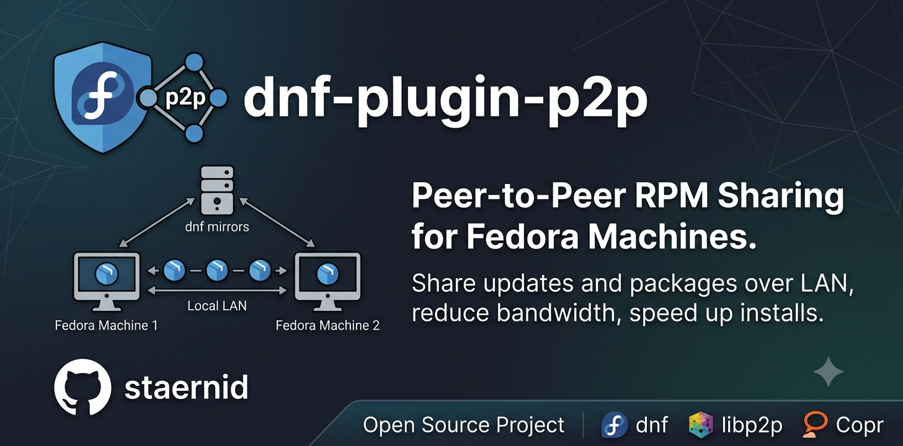

---

## Overview

`dnf-plugin-p2p` enables systems running **DNF 5 / libdnf5** on a local network (LAN) to discover, cache, and share downloaded RPM packages peer-to-peer (P2P). This accelerates package installations and reduces external internet bandwidth usage without requiring any repository configuration changes.

---

## Component Architecture

1. **libdnf5 Plugin (`plugins/p2p_plugin.py`)**: Hooks into DNF 5's transaction lifecycle to rewrite repository URLs to route via the local HTTP proxy and registers target package hashes for security validation.
2. **P2P Proxy Daemon (`p2p-proxy-server/`)**: A background service containing:
   - **HTTP Proxy Server (`p2p_server.py`)**: Intercepts requests, serves cached packages, or falls back to mirrors.
   - **libp2p Node (`p2p_libp2p.py`)**: Uses mDNS (port 8000/TCP) to discover LAN peers and query them for packages.
   - **Local Cache (`p2p_cache.py`)**: Caches validated package files under `/var/cache/dnf-plugin-p2p`.
3. **Diagnostics CLI (`dnf-p2p-client`)**: A command-line monitor displaying connection status, cache efficiency, and bandwidth saved.

---

## Quick Start

### 1. Installation

#### From Copr (Fedora)
```bash
sudo dnf copr enable -y staernid/dnf-plugin-p2p
sudo dnf install -y dnf-plugin-p2p
```

#### From Source
```bash
mkdir build && cd build
cmake ..
make
sudo make install
```

### 2. Service & Firewall Setup
Open the firewall ports for mDNS discovery (`5353/udp`) and libp2p queries (`8000/tcp` and `8000/udp`):
```bash
sudo firewall-cmd --add-port=5353/udp --add-port=8000/tcp --add-port=8000/udp --permanent
sudo firewall-cmd --reload

# Start and enable the proxy daemon
sudo systemctl enable --now dnf-p2p-proxy.service
```

### 3. Monitoring
Use DNF normally (e.g., `sudo dnf install <package>`). You can verify peer connections and cache savings using:
```bash
dnf-p2p-client status
```

---

## Configuration & Docs

- **Configuration File**: Edit `/etc/dnf/libdnf5-plugins/python_plugins_loader.d/p2p_plugin.conf` to customize cache limits, timeouts, and ports.
- **Build Documentation**:
  ```bash
  cmake -B build -S .
  make -C build doc-html
  ```

---

## License

GNU General Public License v2.0 or later.
